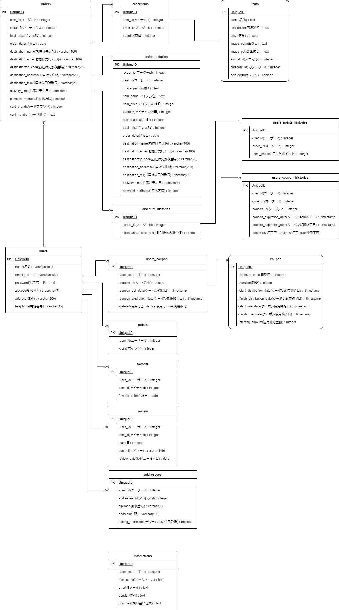

# ECサイト　らくらくペット
らくらくペットでは、ペット用品販売ECサイトを想定し作成しました。
今後も実装機能を追加していく予定です。

## 目次
- [使用ツール](https://github.com/rpentry202204w/ec-202204b##使用ツール)
- [セットアップ](https://github.com/rpentry202204w/ec-202204b##セットアップ)
- [実装機能](https://github.com/rpentry202204w/ec-202204b##実装機能)

## 使用ツール
*フロント*
- HTML 5
- CSS 3
- jQuery(1.11.3)

*サーバー*
- Java(openjdk 18.0.1.1)
- Springboot(2.7.0)
- Thymeleaf
- JavaScript

*データベース*
- PostgreSQL

*テスト*
- JUnit 5

## セットアップ
### Javaインストール
openjdk(18.0.1.1)を使用しています。  
インストールは[こちら](https://jdk.java.net/18/)から。

### Spring Tool Suiteインストール
Spring Tools 4 for Eclipseを使用しています。（最新バージョンは4.15.1です。）  
インストールは[こちら](https://spring.io/tools)から。

### データベース
PostgeSQLを使用しています。  
「student」という名前のデータベースを作成し、[こちら](https://docs.google.com/document/d/1qPmDEEQ5emsmlowiZsx1e-v_p-lIZqphPEnjqm9M5EI/edit)のSQLを実行してください。  

ER図は下記の通りです。  

  
ER図

  
  
  

## 実装機能

  
サイトマップ

  
  

  
ユーザー登録・入力値チェック・ログイン・ログアウト機能

  準備中

  
商品検索時のオートコンプリート機能

  準備中
  商品一覧ページ上部に商品検索フォームを設置しています。  
  フォームに文字を入力すると、それが含まれる商品名が候補として表示されます。  
  
  

